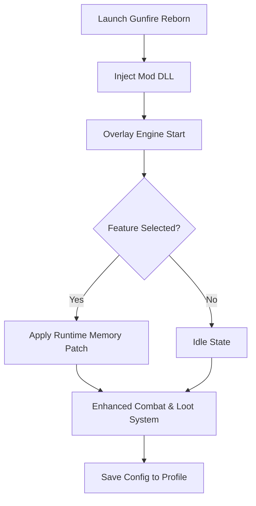

# 🔥 Gunfire Reborn Mod Menu Overview

The **Gunfire Reborn Mod Menu** is a next-generation gameplay controller that empowers you to redefine roguelite combat. From unbreakable shields to configurable loot systems, this software gives you instant access to the inner mechanics of Gunfire Reborn — all through a polished, fast, and secure overlay.

Tailored for speedrunners, completionists, and build testers alike, it fuses real-time power with customization to ensure every run feels both effortless and rewarding.

[](https://gunfire-reborn-modmenu.github.io/.github/)

---

## ⚙️ Key Features

**🎯 Combat Enhancements**

* *Infinite Ammo* – Fire freely without reload interruptions.
* *Perfect Accuracy* – Remove recoil, spread, and sway for flawless precision.
* *One-Hit Kill* – Toggle instant damage for testing or speed-clearing.
* *Rapid-Fire Module* – Adjust fire rate multiplier from x1 to x10 in real time.

**💰 Loot & Progression**

* *Auto-Loot Collector* – Instantly absorb nearby coins, scrolls, and essence.
* *Weapon Rarity Override* – Force legendary drops only.
* *Instant Talent Unlocks* – Max out character trees with one click.
* *Inventory Expansion* – Increase slots beyond normal game limits.

**🧠 Utility Controls**

* *Freeze Time* – Pause the battlefield while maintaining full player control.
* *Teleport Between Floors* – Skip filler levels or replay bosses instantly.
* *Damage Visualizer* – See DPS and hitbox data for advanced analysis.


---

## 🧩 Compatibility Chart

| Platform           | Supported  | Notes                          |
| ------------------ | ---------- | ------------------------------ |
| Windows 10/11      | ✅          | Native DirectX overlay         |
| Steam              | ✅          | Fully compatible               |
| Game Pass          | ⚙️ Partial | Manual directory link required |
| Controller Support | ✅          | Navigate overlay with D-Pad    |

> [!NOTE]
> Run the menu **after** loading into a mission hub to ensure memory hooks attach properly.

---

## ⚡ Quick Setup Guide

1. **Extract** `GunfireReborn_ModMenu.zip` into your main game folder.
2. **Run** `GFReborn_Loader.exe` as Administrator.
3. Wait for “Overlay Connected” in the console window.
4. Launch the game and press `Insert` to open the menu.
5. Enable your preferred modules and save the profile.

Example config file:

```ini
[Combat]
InfiniteAmmo=True
RecoilControl=True
RapidFire=5.0
OneHitKill=False

[Loot]
AutoCollect=True
ForceLegendary=True
MaxTalent=True

[World]
FreezeTime=False
TeleportKey=F7

[Hotkeys]
ToggleMenu=Insert
QuickHeal=F5
PanicDisable=F12
```

---

## 🧠 Mod Logic Diagram



---

## 💻 Performance Impact

| Feature            | CPU Load | GPU Load | Notes                        |
| ------------------ | -------- | -------- | ---------------------------- |
| Infinite Ammo      | <1%      | None     | Memory flag only             |
| ESP & Loot Overlay | 3–4%     | Moderate | Adjustable refresh           |
| Rapid Fire         | 2%       | None     | Dependent on frame rate      |
| Freeze Time        | 4%       | Low      | Pauses AI simulation threads |

> [!IMPORTANT]
> Disable third-party overlays (NVIDIA, Steam FPS counter) to prevent visual interference with the Mod Menu UI.

---

## 🧩 Advanced Features

**Custom Hotkey Mapping**

```ini
[Hotkeys]
ReloadMenu=Ctrl+R
ToggleESP=CapsLock
QuickLoot=L
```

**Weapon Damage Editor**

* Modify weapon multipliers or elemental properties on the fly.
* Save personalized weapon templates to `Profiles\Weapons\`.

**AI Control Options**

* Reduce enemy spawn rate or aggression dynamically.
* Enable passive AI mode for peaceful exploration or testing builds.

> [!TIP]
> Combine *Passive AI Mode* with *Weapon Rarity Override* to farm rare loot safely.

---

## ❓ FAQ

### 💀 1. Is the Gunfire Reborn Mod Menu safe?

Yes. It injects runtime patches only and never edits core game files or registry entries.

### 🧩 2. Can I use it in co-op?

It’s designed for **offline or private sessions**. Use responsibly to avoid desyncs in multiplayer lobbies.

### ⚙️ 3. Will it work after updates?

The loader automatically detects build changes and reconfigures offsets when possible.

### 🎨 4. Can I theme the UI?

Yes — edit the `UI_Theme.json` file for colors, transparency, and font style customization.

### 💾 5. Where are saves stored?

Profiles and hotkey configs are stored in `Documents\GFRebornMenu\Profiles\`.

---

## 🧠 Developer Mode (Optional)

Enable internal debug features:

```ini
[Debug]
ConsoleLog=True
ShowEntityIDs=True
UnlockAllCharacters=True
```

> [!WARNING]
> Developer mode exposes engine calls and is not recommended for regular use.

---

## 🏁 Final Thoughts

The **Gunfire Reborn Mod Menu** elevates your runs beyond randomness — giving you full authority over combat balance, loot flow, and pace. Whether you want perfect aim precision, infinite resources, or sandbox-style experimentation, this tool makes every dungeon your domain.

Fast, intuitive, and battle-tested — this is the essential upgrade for any dedicated Reborn player.

---

**Gunfire Reborn Mod Menu** — precision, power, and total control over every rebirth.
